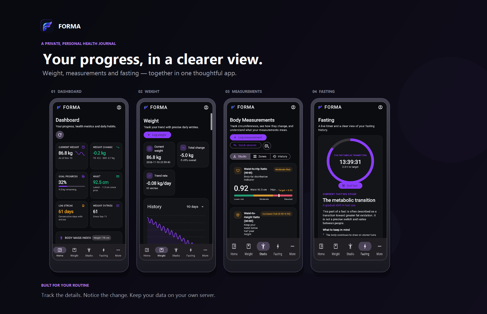

# Forma 💪

### Your body. Your journey. Your data.

**A beautiful, self-hosted body progress tracker for the web and Android.**

Forma helps you understand your body, build healthier habits, and celebrate every bit of progress along the way. Track your weight, measurements, nutrition, fasting, goals, and progress photos — all from one place.

No subscriptions. No third-party fitness platforms. No handing over your personal data.

Just you, your progress, and a server you control.

[](https://github.com/dhruvcx-1/Forma/actions/workflows/publish.yml)
[](LICENSE)
[](https://flutter.dev)
[](https://nodejs.org)

---



<p align="center">
  <a href="screenshots.md">Explore the desktop and Android screenshot gallery →</a>
</p>

---

## 🌱 Your progress, all in one place

Your fitness journey isn't just about the number on a weighing scale. It's about the little changes, the consistency, and the milestones that add up over time.

Forma brings everything together in a single, thoughtfully designed application.

### ✨ Features

| Feature | What you get |
|---|---|
| ⚖️ **Weight Tracking** | Record multiple weigh-ins per day with date and time, explore historical trends, and visualize your journey. |
| 📏 **Body Measurements** | Track body dimensions, monitor changes, and understand body composition estimates. |
| 🎯 **Goals & Milestones** | Set your target weight, follow your progress, and celebrate milestones. |
| 🥗 **Nutrition Tracking** | Set daily calorie and macronutrient targets and log your nutrition. |
| ⏱️ **Fasting Tracker** | Start fasting sessions, monitor elapsed time, and review your history. |
| 📸 **Progress Photos** | Privately store and manage photos to see how far you've come. |
| 👤 **Personal Profile** | Manage your personal information and application preferences. |
| 📦 **Data Portability** | Export and back up your records. |
| 🛡️ **Administration** | Manage accounts and registration settings as an administrator. |

### 📱 One app. Multiple platforms.

Forma is built with Flutter and Material 3, giving you a consistent experience across platforms.

- **Web:** Access Forma directly from your browser.
- **Android:** Use the native Android application.
- **Self-hosted:** Run your own backend and connect multiple clients to it.

### 🔐 Your data stays yours

Forma is designed around self-hosting and data ownership.

- Your database lives on your server.
- Your progress photos stay in your private storage.
- Your clients connect directly to the Forma instance you choose.
- No mandatory cloud account or third-party fitness subscription.

**You own the infrastructure. You control the data.**

> **A quick health note:** BMI, body-fat, energy, and ratio values are estimates based on the information entered. Forma is a personal tracking tool, not a medical diagnostic service.

---

## 🚀 Get started with Docker

Want to get Forma running? All you need is Docker.

The published container includes both the Node.js API and the Flutter Web application. Your SQLite database and uploaded photos are stored in `/app/data`.

### Option 1: Run with Docker

The quickest way to get started:

```bash
# Create persistent storage
docker volume create forma_data

# Start Forma
docker run -d \
  --name forma \
  --restart unless-stopped \
  -p 3001:3001 \
  -e NODE_ENV=production \
  -e PORT=3001 \
  -e COOKIE_SECRET="replace-with-a-long-random-secret" \
  -v forma_data:/app/data \
  ghcr.io/dhruvcx-1/forma:latest
```

**Before you launch:**

Generate a unique secret of at least 32 characters for `COOKIE_SECRET`.

Open Forma at:

- Local machine: `http://localhost:3001`
- Network access: `http://SERVER_ADDRESS:3001`

For internet-facing deployments, put Forma behind an HTTPS-enabled reverse proxy. Use that HTTPS address when connecting your Android application.

**Health check:** `/api/health`

### Option 2: Docker Compose + Traefik

Already running Traefik? Forma has you covered.

The repository includes a Docker Compose configuration designed to work with an existing Traefik reverse proxy.

You'll need:

- An existing Docker network named `reverse-proxy`.
- A configured `FORMA_DOMAIN`.
- A configured `PUBLIC_URL`.
- A secure `COOKIE_SECRET`.

Configure your `.env` file before deployment:

```bash
cp .env.example .env
```

Edit the environment variables and launch:

```bash
docker compose up -d
```

Don't use Traefik? You can adapt the Compose networking and labels for your preferred reverse proxy, or simply use the standalone Docker command above.

**Configuration references:**
- [Environment variables](.env.example)
- [Docker Compose configuration](docker-compose.yml)

---

## 🔄 Updates & backups

Keeping Forma up to date is straightforward.

For Docker Compose deployments:

```bash
docker compose pull
docker compose up -d
```

Your persistent `forma_data` volume contains your database and uploaded photos.

**Important:** Back up this volume before upgrading. Never delete it when replacing or updating the container.

For details about storage locations and deployment boundaries, check the [Flutter migration and architecture notes](docs/flutter-migration.md).

---

## 🤖 Android application

Prefer tracking your progress on your phone?

Download the latest Android APK:

<p align="center">
  <a href="https://github.com/dhruvcx-1/Forma/releases/tag/android-latest">
    
  </a>
</p>

Forma provides a host-configurable APK, which means:

1. Download and install the APK.
2. Launch Forma.
3. Enter the URL of your self-hosted Forma server.
4. Start tracking!

The public APK does not have a hardcoded server address. Your selected server URL is saved locally on your device.

**A few things to know:**
- Use HTTPS when connecting to a remote server.
- Your phone must be able to reach the configured server.
- For local network deployments, use an address accessible from your phone.

### Build an APK with your own server address

You can also build a personal APK with a default server address using `FORMA_API_BASE_URL`.

Keep in mind that this address is embedded in the APK and can be inspected.

---

## 🛠️ Build from source

Want to contribute, experiment, or build your own version of Forma?

Here's everything you need.

### Requirements

| Dependency | Version |
|---|---|
| Node.js | 22 |
| npm | Included with Node.js |
| Flutter | 3.47.9 or compatible stable SDK |
| Android Studio | Required only for Android development |
| Android SDK | Required only for Android development |

### 1. Clone and install backend dependencies

From the repository root:

```bash
npm ci
npm run dev
```

This starts the Node.js backend.

### 2. Launch the Flutter Web application

Open another terminal:

```bash
cd packages/flutter_app

flutter pub get

flutter run -d chrome \
  --dart-define=FORMA_API_BASE_URL=http://localhost:3001
```

### 3. Run on Android

For an Android emulator, use `10.0.2.2` to reach the development machine's localhost:

```bash
cd packages/flutter_app

flutter run \
  --dart-define=FORMA_API_BASE_URL=http://10.0.2.2:3001
```

For a physical Android device, make sure both devices can communicate over your network. Use your development computer's LAN address or a reachable HTTPS server.

Local HTTP is intended for development.

---

## 📦 Build production artifacts

Run the following commands from `packages/flutter_app`.

**Build for the web:**

```bash
flutter build web --release
```

**Build the host-configurable Android APK:**

```bash
flutter build apk --release
```

**Build an APK with your own default server address:**

```bash
flutter build apk --release \
  --dart-define=FORMA_API_BASE_URL=https://your-forma-host.example
```

**Build an Android App Bundle:**

```bash
flutter build appbundle --release
```

### Build outputs

| Artifact | Location |
|---|---|
| Android APK | `build/app/outputs/flutter-apk/app-release.apk` |
| Flutter Web | `build/web` |

The Docker build automatically generates and packages the Flutter Web application.

---

## 🧪 Development & testing

We want Forma to stay reliable as it grows.

Run the backend checks from the repository root:

```bash
npm test
npm run build
```

Run Flutter checks from `packages/flutter_app`:

```bash
flutter analyze
flutter test
```

### Demo data

Want to explore Forma without entering everything manually?

You can populate a disposable local database with demonstration data.

Set `DATABASE_PATH` to a new database file before starting the backend, then run:

```bash
npm run db:seed
```

**Demo credentials:**

| Field | Value |
|---|---|
| Username | `demo` |
| Password | `password123` |

⚠️ **Warning:** The seeder resets and repopulates the selected database. Never run it against a database containing real user data.

---

## 🏗️ Under the hood

Forma combines a modern cross-platform frontend with a lightweight, self-hostable backend.

| Layer | Technology |
|---|---|
| Frontend | Flutter & Dart |
| Design system | Material 3 |
| Charts | `fl_chart` & custom Flutter widgets |
| Backend | Node.js 22, Fastify & TypeScript |
| Validation | Zod |
| Database | SQLite (`better-sqlite3`) with WAL |
| Authentication | Argon2id password hashing |
| Deployment | Docker & Docker Compose |
| CI/CD | GitHub Actions |

### Architecture at a glance

```text
           ┌─────────────────────┐
           │    Forma Server    │
           │                     │
           │   Node.js + Fastify │
           │                     │
           │    ┌───────────┐    │
           │    │  SQLite   │    │
           │    │ Database  │    │
           │    └───────────┘    │
           │                     │
           │   Private Photos    │
           └──────────┬──────────┘
                      │
                 HTTP API
                      │
             ┌────────┴────────┐
             │                 │
       ┌─────▼─────┐     ┌─────▼─────┐
       │   Flutter │     │  Flutter  │
       │    Web    │     │  Android  │
       └───────────┘     └───────────┘
```

### Automated builds & releases

GitHub Actions handles the project's automated validation and distribution.

- Validates the backend and Flutter application.
- Builds a host-configurable Android APK.
- Publishes multi-architecture Docker images (`amd64` and `arm64`).
- Publishes Docker images to [GitHub Container Registry](https://github.com/dhruvcx-1/Forma/pkgs/container/forma).
- Attaches the Android APK to the `android-latest` prerelease.

Want a personal APK with a predefined server address?

Configure the `FORMA_PERSONAL_API_BASE_URL` repository secret. GitHub Actions can then build a separate personal APK without changing the public release APK.

### Want to learn more?

Check out the [Flutter architecture and migration notes](docs/flutter-migration.md).

The backend exposes an HTTP API under `/api`, with `/api/health` available as its health endpoint.

---

## 🤝 Contributing

Forma is an open-source project, and contributions are welcome!

Whether you're fixing bugs, improving the UI, adding features, or making the documentation better, every contribution helps Forma grow.

Feel free to explore the codebase, report issues, or submit pull requests.

---

## 📄 License

Forma is proudly released under the **[MIT License](LICENSE)**.

Use it, modify it, self-host it, and make it your own.

---

<p align="center">
  <strong>Made with ❤️ for people who own their data.</strong>
  <br>
  <sub>Your journey. Your progress. Your Forma.</sub>
</p>
